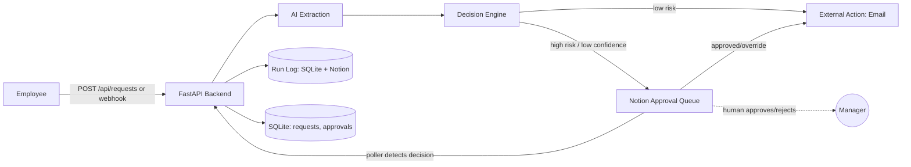

# ProcureFlow

AI-powered corporate purchase approval agent — built for the **Automate India Hackathon, Notion Track**.

## Problem

Corporate purchase requests are slow and inconsistent: employees email or Slack a manager, someone eventually reads it, checks a budget in their head, and replies. Routine, low-value purchases wait in the same queue as ones that genuinely need scrutiny, and there's no audit trail of who decided what, when.

## Solution

Employees submit a request in plain language. ProcureFlow uses AI to extract what's actually being asked for (item, quantity, category, estimated cost), runs it through a **deterministic, configurable policy engine** (not the AI) to decide whether it's routine or risky, and:

- **Auto-processes** routine, low-value, high-confidence requests — sending a real procurement notification email.
- **Routes to a human** in Notion for anything expensive, ambiguous, low-confidence, or unusual — where a manager approves, rejects, or overrides.

Every step writes a timestamped Run Log entry, in the app's own database and mirrored into Notion, so the whole thing is auditable.

## Architecture



See `docs/architecture.md` for the full request lifecycle diagram.

## Features

- Natural-language purchase request intake (API + webhook)
- Configurable AI provider: OpenAI, Anthropic, or a labeled rule-based mock for offline development
- Deterministic policy engine (amount threshold, confidence threshold, category checks) — the AI never has unilateral approval authority
- Notion as the human-readable control plane: Purchase Requests DB, Approval Queue, Run Log
- Background poller that detects human decisions in Notion and resumes the workflow — no manual script required during a demo
- Real external action: procurement notification email (SMTP), with a transparent dev-mode fallback
- Idempotency via request hashing — duplicate submissions never double-process
- Retry-with-backoff around Notion, explicit `FAILED` / `NEEDS_REVIEW` / `ACTION_FAILED` states instead of crashes
- React dashboard for visibility (not the system of record — Notion and the backend are)

## Tech Stack

- **Backend:** Python, FastAPI, SQLAlchemy, SQLite
- **AI:** OpenAI / Anthropic (configurable), with a rule-based mock fallback
- **Control plane:** Notion API (`notion-client`)
- **Frontend:** React + Vite
- **External action:** SMTP email

## Notion Setup

1. Create an integration at https://www.notion.so/my-integrations and copy its secret.
2. Create (or pick) a parent page in Notion, then **Add connections → your integration** on that page.
3. Put the integration token in `.env` as `NOTION_TOKEN`, and the parent page ID as `NOTION_PARENT_PAGE_ID`.
4. Run:
   ```bash
   cd backend && pip install -r requirements.txt
   python ../scripts/setup_notion.py --parent-page-id <page_id>
   ```
5. Copy the three printed database IDs into `.env` (`NOTION_REQUESTS_DATABASE_ID`, `NOTION_APPROVALS_DATABASE_ID`, `NOTION_RUN_LOG_DATABASE_ID`).

### How to connect Notion

1. Create an internal integration at `https://www.notion.so/my-integrations` and copy its secret to `NOTION_TOKEN`.
2. Create a parent page in the target workspace. Open the page menu, choose **Add connections**, and select the ProcureFlow integration.
3. Set `NOTION_PARENT_PAGE_ID` in `.env` (or pass `--parent-page-id` to the setup command).
4. From the repository root, run the setup command below. It loads `.env`, verifies the token, and creates the three databases with the schema used by the backend.
5. Copy the three printed database IDs into `.env`, then restart the backend.
6. Open **Integrations** in the frontend and use **Test Connection / Validate Schema**.
7. Submit a high-value request, open its Approval Queue item in Notion, change `Status` from `Pending` to `Approved` or `Rejected`, and wait for the poller (or use **Sync Now**).

PowerShell setup command:

```powershell
cd backend
.\venv\Scripts\python.exe ..\scripts\setup_notion.py --parent-page-id <page_id>
```

If the integration is configured but cannot access Notion, the diagnostics endpoint reports the corrective action. Share the parent page and all created databases with the integration; do not remove the token to hide a permission failure.

Without these set, the backend runs in Notion **DEV_MODE**: it logs what it would have written instead of calling the API, so you can still develop and test the rest of the pipeline. Details in `docs/hackathon-compliance.md`.

## Environment Variables

See `.env.example` at the repo root for the full list (Notion, AI provider, SMTP, policy thresholds, webhook secret). Copy it to `.env` and fill in real values before the demo:

```bash
cp .env.example .env
```

## Local Installation

```bash
# Backend
cd backend
python -m venv venv && source venv/bin/activate
pip install -r requirements.txt

# Frontend
cd ../frontend
npm install
```

## Running Backend

PowerShell (Windows):

```powershell
cd backend
.\venv\Scripts\python.exe -m uvicorn app.main:app --reload --port 8000
```

macOS/Linux (after activating the virtual environment):

```bash
cd backend
python -m uvicorn app.main:app --reload --port 8000
```
Visit `http://localhost:8000/health` and `http://localhost:8000/docs` (auto-generated API docs).

## Running Frontend

```bash
cd frontend
npm run dev
```
Visit `http://localhost:5173`. Set `VITE_API_BASE_URL` if the backend isn't on `localhost:8000`, and `VITE_NOTION_WORKSPACE_URL` to point the "Open Notion Workspace" button at your real workspace.

## Running Tests

```bash
cd backend
pytest -v
```

Covers request validation, the mock AI provider, the decision engine's rule branches, idempotency hashing, and full end-to-end workflow runs (auto-process, approval-required, ambiguous/needs-review, duplicate detection, self-approval blocking, human approve/reject, and AI/Notion/action failure handling). See `docs/setup.md` for what each test group verifies.

## Demo Scenarios

With the backend running:
```bash
python scripts/seed_demo_data.py --base-url http://localhost:8000
```

1. **Automatic** — "5 keyboards for engineering" → low risk → auto-processed → email sent → Run Log.
2. **Human approval** — "3 MacBook Pro laptops for data science" → high risk → Notion Approval Queue → approve in Notion → poller detects it → email sent → Run Log.
3. **Bad input** — "I need something urgently" → low confidence → Needs Review, no external action → Run Log.

## API Documentation

Interactive docs at `/docs` (Swagger) once the backend is running. Core endpoints:

| Method | Path | Purpose |
|---|---|---|
| GET | `/health` | Liveness check |
| POST | `/api/requests` | Submit a purchase request |
| GET | `/api/requests` | List all requests |
| GET | `/api/requests/{id}` | Full detail for one request |
| GET | `/api/requests/{id}/runs` | Run Log history for one request |
| POST | `/api/requests/{id}/retry` | Re-run processing after a failure |
| POST | `/api/requests/{id}/sync` | Poll Notion and synchronize one request |
| POST | `/api/webhooks/purchase-request` | Webhook trigger (same pipeline as above) |
| GET | `/api/integrations/status` | Safe AI/Notion/poller integration diagnostics |
| POST | `/api/integrations/notion/validate` | Test Notion access and required properties |
| GET | `/api/notion/status` | Real Notion authentication and database status |
| POST | `/api/notion/setup` | Discover or create the ProcureFlow Notion hierarchy |
| POST | `/api/notion/sync` | Poll all pending Notion approvals immediately |

## Failure Handling

See `docs/hackathon-compliance.md` for the full mapping. Summary: AI failures → `NEEDS_REVIEW`; Notion failures → retried with exponential backoff, then logged as a failure without crashing the request; external action (email) failures → `ACTION_FAILED`, never silently marked complete; malformed/duplicate input never creates a second action.

## Security

- All secrets via environment variables; `.env` is gitignored
- Optional shared-secret header (`X-Webhook-Secret`) on the webhook endpoint
- CORS restricted outside development
- Input validated and length-capped with Pydantic
- No API keys or tokens ever sent to the frontend

## Deployment

See `DEPLOYMENT.md`.

## Future Improvements

- Multi-level approval chains for very large purchases
- Slack notifications alongside email
- Budget-aware risk scoring per department
- Webhook signature verification (HMAC) instead of a shared secret
