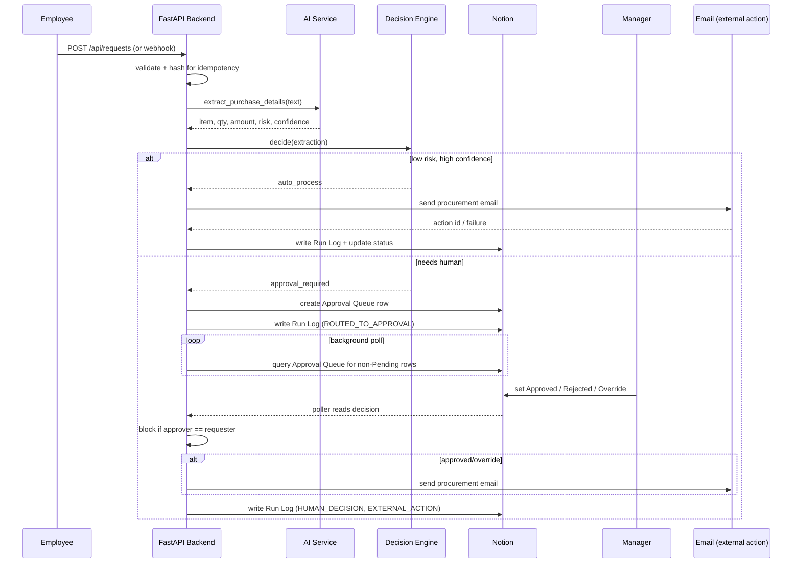

# Architecture

## Request lifecycle

## Failure isolation

Each external dependency (AI provider, Notion, SMTP) fails independently without taking down the request:

- AI failure → status `NEEDS_REVIEW`, routed to a human, Run Log records `AI_CLASSIFIED / FAILURE`.
- Notion failure → retried 3x with exponential backoff; if still failing, the *local* Run Log records the failure and the workflow continues (the request isn't blocked on Notion being reachable).
- Email failure → status `ACTION_FAILED`, never `COMPLETED`; retryable via `POST /api/requests/{id}/retry`.

## Data model

- `requests` — one row per purchase request, the source of truth for current status.
- `approvals` — one row per approval cycle (supports retries/overrides without losing history).
- `run_logs` — append-only, one row per workflow event, mirrored into the Notion Run Log database.
